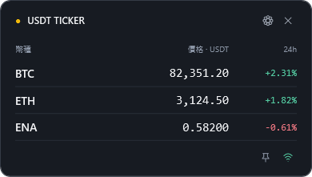
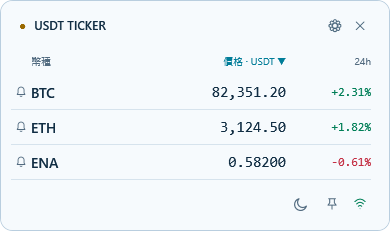
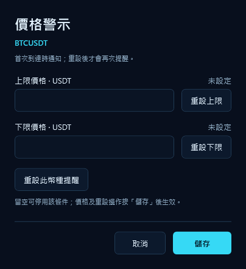
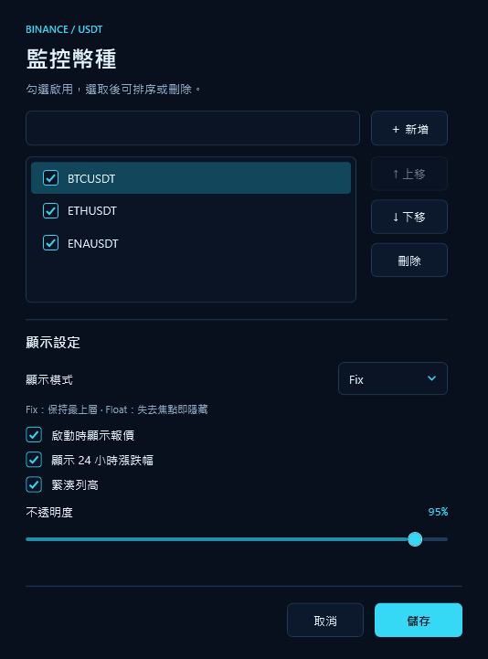
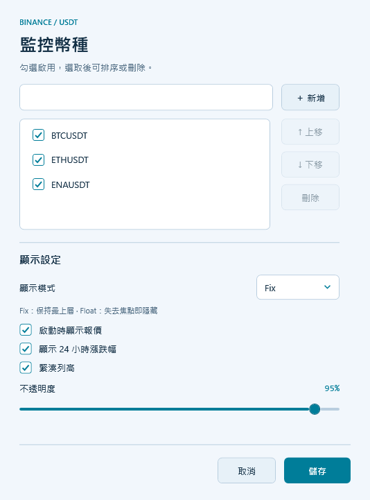
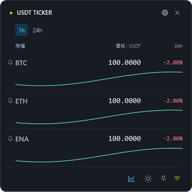

# Binance USDT Desktop Ticker

**工作時，偶爾看一眼行情。把價格放在桌面的小角落，留給自己欣賞。**

寫程式、整理報表或專心處理工作時，想知道關注的幣種現在多少錢，
不用再打開網頁、切換分頁。Binance USDT Desktop Ticker 用一個小巧的
Windows 桌面視窗，顯示你選擇的幣種價格與 24 小時漲跌幅。
也能為每個幣種設定價格上下限，首次到達目標時收到 Windows 通知。
每列亦可查看最近 1 小時或 24 小時走勢，點擊幣種名稱查看行情詳情。

拖到喜歡的角落，讓它安靜陪著你；想看時瞄一眼，想專心時收回系統匣。
**不需要 Binance 帳號，不需要 API Key，也不需要提供個人資訊。**

## 畫面預覽

以下為程式實際介面，報價使用示例資料，並非即時行情。

### 報價視窗

在桌面小角落查看價格與 24 小時漲跌幅；點幣種左側的鈴鐺設定價格警示，
點齒輪管理監控幣種與顯示選項，點欄位標題可切換排序。
右下角圖示顯示觀看模式與連線狀態。

| 深色模式 | 淺色模式 |
| --- | --- |
|  |  |

### 價格警示視窗

點擊幣種左側的鈴鐺，開啟該幣種的獨立視窗，設定上下限、查看提醒狀態或重設提醒。
價格與重設操作按「儲存」後生效；不同幣種可各自開啟視窗。



### 設定畫面

新增、勾選、排序或刪除監控幣種，調整觀看模式、顯示欄位、列高與透明度，按「儲存」套用。



<details>
<summary>查看淺色設定畫面</summary>



</details>

## 下載

[**前往 GitHub Releases 下載**](https://github.com/kimx-solutions/BnUsdtTicker/releases)

版本發佈後，在 Release 的 **Assets** 下載 `BinanceTicker-v版本號-win-x64.zip`。
發佈包適用於 Windows x64，內含 .NET 執行環境，不需要另外安裝 .NET。

1. 下載 ZIP，完整解壓縮到你喜歡的資料夾。
2. 執行 `BinanceTicker.exe`，開始查看行情。
3. 日後更新時，先從系統匣結束舊版，再解壓縮並開啟新版；本機設定會保留。

同一頁亦提供 `.zip.sha256` 校驗檔，可用來確認下載檔案的 SHA256 是否相符。

## 使用說明

### 走勢與行情詳情



報價列下方預設顯示最近 **1h** 走勢；工具列的 **24h** 可切換所有幣種的範圍，
右下角、深／淺色切換左側的 **走勢圖示** 可收起或展開圖表；顯示時為青藍色，
隱藏時為灰色並加斜線，滑鼠提示會顯示下一個操作。這些偏好會保存，下次啟動沿用。
圖表使用 Binance 公開的 1 分鐘收盤價；顏色表示所選時段的方向，與 24 小時漲跌幅分開計算。
資料只有部分時會按實際時間顯示，缺口不連線；走勢載入失敗不影響價格與警示。

點擊 **幣種名稱** 開啟獨立行情詳情，查看最新價格、24h 漲跌幅、最高／最低、
以該幣種計量的成交量及 USDT 成交額。不同幣種可同時開啟，同一幣種會重用視窗。
**重試走勢** 可重新載入；**開啟 Binance 現貨** 透過預設瀏覽器開啟該交易對頁面。
Float 模式主窗隱藏後，詳情仍可使用；停用或刪除幣種會關閉對應詳情。

初次載入走勢可能稍需等待；連線中斷或資料超過 60 秒未更新時，
畫面會標示狀態並保留最後資料。視窗隱藏且沒有詳情開啟時，不會新建歷史請求。

開啟後，預設顯示 BTC、ETH、ENA 對 USDT 的最新價格與 24 小時漲跌幅。
拖曳視窗的空白處或報價列，就能把它放到桌面的小角落；最後位置會自動記住。

點擊「幣種」、「價格 · USDT」或「24h」欄位標題可排序；第一次點擊為升冪，
再次點擊同一欄位切換為降冪，青藍色的 ▲／▼ 表示目前方向。
行情更新時會維持選定的排序，尚未收到報價的幣種在數值排序時排在最後。
未選擇排序或重新啟動程式時，沿用設定中的幣種順序。

### 兩種觀看方式

| 模式 | 行為 | 適合的使用方式 |
| --- | --- | --- |
| **Fix** | 保持在其他視窗上方，切換程式仍顯示 | 放在角落，工作時偶爾瞄一眼 |
| **Float** | 點系統匣叫出，點到其他程式時自動隱藏 | 想看時叫出，看完繼續工作 |

右鍵點擊右下角系統匣（System Tray）的**程式圖示**，即可切換模式。
圖示可能收在系統匣的隱藏圖示選單中。
報價視窗右下角用圖示表示模式與連線狀態，滑鼠移上去可查看文字說明。
連線圖示為綠色時表示已連線，黃色表示連線中，紅色表示斷線。

### 切換淺色／深色

點報價視窗右下角的**太陽圖示**切換為淺色，點**月亮圖示**切回深色。
報價視窗、設定畫面、已開啟的價格警示視窗與系統匣選單會同步套用配色，不影響行情連線。
預設使用深色；選擇會自動保存在本機，下次啟動沿用。

### 選擇你想看的幣種

1. 點報價視窗右上角的齒輪，或在系統匣選單選擇「設定」。
2. 輸入 `BTC`、`ETH`、`NEAR` 等代號並按「新增」，也可以直接輸入 `BTCUSDT`。
3. 勾選要顯示的幣種；選取一列後，可使用「上移」、「下移」或「刪除」。
4. 按「儲存」套用；按「取消」放棄這次編輯。

新增時會向 Binance 驗證是否存在可交易的 USDT 現貨交易對。
設定也能調整透明度、緊湊列高、24 小時漲跌幅欄位，以及啟動時是否顯示視窗。

### 價格上下限提醒

1. 點擊報價列幣種左側的鈴鐺，開啟該幣種的「價格警示」視窗。
2. 輸入上限、下限 USDT 價格，可只設定其中一項；價格須為正數，小數點使用 `.`，不輸入千分位逗號。
3. 按「儲存」套用；留空並儲存可停用該條件，按「取消」或關閉警示視窗會放棄這次編輯。

上限在價格 **≥ 設定值** 時提醒，下限在價格 **≤ 設定值** 時提醒，包含首次載入的報價。
例如上限設為 `85000`，報價到達 `85000` 或更高時會提醒。
警示由左側鈴鐺編輯，一般設定只管理監控幣種與顯示設定。

| 鈴鐺顏色 | 狀態 |
| --- | --- |
| 灰色 | 尚未設定上下限 |
| 青色 | 已設定至少一個條件 |
| 黃色 | 至少一個條件已提醒 |

滑鼠移到鈴鐺可查看狀態，點擊可編輯或重設。

每個條件只提醒一次，上限與下限互相獨立。「已提醒」狀態會保存，重新啟動、
行情重新連線或修改目標價都不會自動重設。

在警示視窗使用「重設上限」、「重設下限」或「重設此幣種提醒」，
再按「儲存」，即可重新等待下一筆符合條件的報價；按「取消」會放棄編輯及重設操作。
停用的幣種不檢查提醒，既有紀錄與狀態仍會保留。
同一幣種再次點擊會回到已開啟的視窗；不同幣種可同時編輯。
一般設定與警示視窗同時開啟時，儲存一般設定會保留最新的警示內容。

通知包含幣種、上下限、實際價格及目標價，透過 Windows 系統匣通知送出。
每次成功提交通知會保存一筆紀錄於 `%LOCALAPPDATA%\BinanceTicker\alerts-history.json`，
包含 `symbol`、`alertType`、`targetPrice`、`triggeredPrice`、`triggeredAt`（含時區）。
重設不刪除歷史紀錄；未觸發的價格更新不建立紀錄。

通知是否顯示與顯示時間由 Windows 通知／勿擾設定控制，紀錄代表程式已提交通知。
設定或紀錄檔寫入失敗時不送出通知；通知提交拋出錯誤時會還原該次紀錄與狀態。
若還原也遇到寫入錯誤，會暫停新的提醒提交；恢復寫入權限後，先還原失敗的操作再繼續提醒。
若歷史檔損壞，程式會保留檔案並提示錯誤，請先備份後修復該 JSON 檔。
設定、紀錄檔與 Windows 通知分屬不同操作；若在提交期間強制終止程式或斷電，
可能留下一筆已保存但未顯示的通知，需自行確認並重設。

### 隱藏、叫回與結束

報價視窗可拖曳四邊或角落調整大小，滑鼠會顯示縮放方向，停留可查看操作提示。
一般最小尺寸為 360 × 260，預設為 390 × 360（DIP）；清單超過可用高度時可捲動，
頂部設定與底部控制項保持可操作。最後尺寸與位置會保存，隱藏／叫回、Fix／Float
切換或重啟後沿用；系統匣的「恢復預設大小」可重設尺寸。
螢幕、DPI 或工作區變動時，會限制尺寸並把視窗移回目前或最近螢幕的可見工作區。

設定中的「使用全域快捷鍵顯示／隱藏報價」預設關閉，啟用後輸入組合並儲存，
例如 `Ctrl+Alt+T`；可使用 Ctrl、Alt、Shift、Win 加字母、數字、功能鍵或導航鍵。
F12 為 Windows 保留。即使焦點在其他程式，快捷鍵也可切換報價顯示；衝突時
儲存會顯示錯誤並保留原本的設定，可修改或停用。啟動時註冊失敗會提示，行情仍可使用。

「登入 Windows 後自動啟動」預設關閉，與「啟動時顯示報價」分開控制。
勾選後儲存，會為目前使用者建立登入啟動項，不需系統管理員權限；取消並儲存即可移除。
請從已發佈的 `BinanceTicker.exe` 設定此選項，含空白路徑會正確引用；
路徑過長或 Windows 拒絕寫入時會顯示錯誤。
移動程式後，請手動執行新位置的程式以修復啟動路徑；舊位置不存在時無法自行啟動。
Windows 工作管理員若停用了此啟動項，需在「啟動應用程式」重新啟用。
同一登入工作階段只執行一份程式，重複啟動會退出，不會建立第二份報價或提醒。

- **暫時隱藏**：點報價視窗的 X 或按 `Alt+F4`；程式仍在系統匣常駐。
- **重新叫出**：左鍵點系統匣的程式圖示，或右鍵選「顯示報價」。
- **結束程式**：右鍵點系統匣的程式圖示，選擇「結束程式」。

網路中斷時，視窗會保留最後收到的報價並自動嘗試重新連線。
滑鼠移到報價列可查看最後更新時間；斷線期間顯示的價格是最後一次收到的資料。

## 安全與隱私

**看行情，只需要公開價格。你的帳號、資產與個人資料，都不需要交給這個工具。**

- **不需要 API Key**：直接讀取 Binance 公開市場報價，無需建立或貼上金鑰。
- **不要求個人資訊**：沒有註冊或登入流程，不收集、不使用姓名、Email、電話等個人資料。
- **不存取你的帳戶**：不讀取 Binance 帳戶、資產、交易紀錄，也不提供下單或轉帳功能。
- **沒有使用追蹤**：程式沒有廣告、分析追蹤或遙測上傳功能。
- **設定與提醒紀錄保存在本機**：監控幣種、視窗位置、顯示偏好、警示價格及提醒紀錄儲存在你的電腦，不會上傳。
- **行情連線使用加密傳輸**：透過 HTTPS / WSS 直接向 Binance 取得公開行情。

查價時會向 Binance 傳送交易對代號；Binance 也會收到一般網路連線資訊，例如 IP 位址。
程式不會因此要求或傳送你的 Binance 登入資料或 API Key。
原始碼可在[本專案](https://github.com/kimx-solutions/BnUsdtTicker)檢視。

## 本機設定

設定自動儲存於 `%LOCALAPPDATA%\BinanceTicker\settings.json`。
價格警示的上下限與已提醒狀態也保存在設定檔；提醒紀錄另存於同資料夾的 `alerts-history.json`。
更換程式資料夾或更新版本時，偏好設定與提醒紀錄仍會保留。
若設定檔損壞，程式會先備份為 `settings.json.bak`，再恢復預設值。
顯示器配置改變時，會嘗試把螢幕外的報價視窗移回主螢幕工作區。

可參考 [settings.example.json](settings.example.json)；手動編輯設定檔前，請先結束程式。

## 免責聲明

本專案是獨立開源工具，並非 Binance 官方產品，也未獲 Binance 背書。
顯示的行情僅供資訊參考，不構成投資建議、交易建議或買賣邀約。

報價來自 Binance 公開市場資料，可能因網路、服務中斷或資料更新而延遲、缺漏或不準確。
斷線時會保留最後收到的價格；進行任何交易前，請自行向交易平台確認最新報價。
使用者應自行判斷並承擔投資風險。

本軟體依 MIT 授權按「現況」提供，不保證行情的準確性、完整性、即時性或服務持續可用。
作者與著作權人不就使用本軟體或依其資料作出的決策及損失承擔責任；完整條款請見 [LICENSE](LICENSE)。

## 授權

本專案採用 [MIT License](LICENSE)，允許使用、修改、散布及商業使用，
但必須保留原有著作權聲明與授權條款。
隨發佈包附帶的第三方元件，仍適用各自的授權。

<details>
<summary>給開發者：執行、建置、發佈與測試</summary>

## 從原始碼執行

專案使用 .NET 10 / WPF / MVVM，需要 Windows 與 .NET 10 SDK：

```powershell
dotnet run --project src/BinanceTicker
```

價格 ≥1000 顯示 2 位、≥1 顯示 4 位、≥0.01 顯示 5 位，其餘顯示 8 位小數。
初始資料使用 REST `/api/v3/ticker/24hr`；即時資料使用 combined
`<symbol>@ticker` WebSocket，約每秒更新。[Binance 官方串流文件](https://developers.binance.com/docs/binance-spot-api-docs/web-socket-streams)。
斷線依 1、2、5、10、30 秒重試，收到行情後重設延遲。
REST/驗證有 10 秒逾時；停用全部幣種時不建立行情連線。

## 建置與驗證

```powershell
dotnet build --configuration Release
dotnet test --configuration Release
dotnet publish src/BinanceTicker --configuration Release --runtime win-x64 --self-contained true -o artifacts/publish
```

執行 `artifacts/publish/BinanceTicker.exe`。自包含版本不需要另外安裝 .NET runtime。
CI 在 Windows 上執行建置、測試及發佈封裝。

## GitHub Release

先將包含 `.github/workflows/release.yml` 的程式碼推送到 GitHub，再建立版本標籤：

```powershell
git tag v1.0.0
git push origin v1.0.0
```

`Release Windows app` workflow 會檢出該標籤的程式碼，依序還原、建置、測試、
發佈 Windows x64 自包含版本，再建立 GitHub Release 與自動產生的版本說明。
版本號會寫入程式組件。`v1.0.0-beta.1` 等帶後綴的版本會標示為 Pre-release。
一般 branch push/PR 使用原本 CI，版本 tag 使用 Release workflow。

Release 附件：

- `BinanceTicker-v1.0.0-win-x64.zip`：完整程式、.NET runtime、README、LICENSE 與設定範例。
- `BinanceTicker-v1.0.0-win-x64.zip.sha256`：ZIP 的 SHA256 校驗值。

下載並完整解壓縮 ZIP，執行 `BinanceTicker.exe`，無需安裝 .NET。
Workflow 使用 GitHub 自動提供的 `GITHUB_TOKEN`，不需另外設定 PAT。

亦可在 Actions → **Release Windows app** → **Run workflow** 輸入已推送的
版本標籤。手動執行入口需要 workflow 存在於預設分支；請選擇包含此 workflow
的分支。流程仍會建置輸入標籤的程式碼，標籤必須存在。
重新執行時，已存在的附件會保留。若 ZIP 已上傳但校驗檔缺少，會下載原本的
ZIP 產生相符校驗檔；若只剩校驗檔，會先核對重建 ZIP，確認一致才補上。
上次失敗留下的草稿會在附件齊全後正式發佈。
測試結果與 ZIP 也會保存在該次 Actions run 的 artifacts 中。
發佈採用 [GitHub CLI 的 Release 指令](https://cli.github.com/manual/gh_release_create)。

## 測試與實機驗收

測試使用受控 HTTP/WebSocket 資料，無需 Binance 網路，包括 JSON 損壞備份、
價格精度、幣種管理、串流分段、重連延遲及 WPF 視窗生命週期。
價格提醒測試涵蓋上下限邊界、獨立單次狀態、重啟、重設、高頻並行更新、
紀錄內容、寫入／通知失敗還原、獨立警示視窗的儲存／取消，以及一般設定與警示編輯交錯時的狀態保存。
WPF smoke test 使用 STA 執行緒建立實際視窗並短暫顯示，檢查 X 隱藏、
模式切換、失焦處理、位置修正及 XAML 載入。

實機驗收：

1. 開啟程式，確認真實價格持續更新；斷網/復網確認狀態與重連。
2. Fix 切到另一程式仍顯示；Float 點另一程式即隱藏；Tray 可叫回。
3. 拖曳、隱藏、重開程式，確認位置保存；設定新增/排序/停用/取消正常。
4. 將視窗放到不同 DPI 的外接螢幕，拔除螢幕或重新啟動，確認視窗回到可見工作區。
5. Tray 結束後確認程序退出與圖示移除。
6. 點擊左側鈴鐺，設定一個高於目前價格的下限並儲存，確認下一筆報價收到 Windows 通知且只提醒一次；
   重啟後不重複提醒，重設並儲存後可再次提醒。檢查 `alerts-history.json` 的價格與時間。
7. 同時開啟一般設定與警示視窗，先儲存警示、再儲存一般設定，確認新警示仍保留；
   再開啟不同幣種的警示視窗，確認各自編輯、取消與儲存互不影響。

8. 縮放四邊及四角，確認縮放游標、排序／鈴鐺／捲軸操作與拖曳互不衝突；長清單在最小尺寸可捲動，兩種主題與 Fix／Float 均正常。
9. 隱藏／叫回、重啟及恢復預設大小，確認尺寸與位置；在 100%／150%／200% DPI 螢幕間移動，變更工作區或拔除外接螢幕，確認整個視窗仍可操作。
10. 設定全域快捷鍵，在其他程式取得焦點時確認顯示／隱藏；用同組合測試衝突，停用或結束後確認其他程式可註冊。
11. 用含空白路徑的已發佈程式開啟登入啟動，登出／登入，分別測試「啟動時顯示報價」開關；重複啟動只留一份程序。移動程式後手動執行新位置修復，再測試取消啟動。

目前提供即時報價、價格警示、1 分鐘歷史走勢與行情詳情，不含帳戶登入或下單。

</details>
